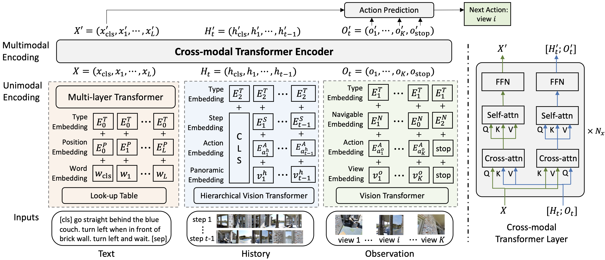

# History Aware Multimodal Transformer for Vision-and-Language Navigation

This repository is the official implementation of [History Aware Multimodal Transformer for Vision-and-Language Navigation](https://arxiv.org/abs/2110.13309). 

Project webpage: https://cshizhe.github.io/projects/vln_hamt.html

Vision-and-language navigation (VLN) aims to build autonomous visual agents that follow instructions and navigate in real scenes. In this work, we introduce a History Aware Multimodal Transformer (HAMT) to incorporate a long-horizon history into multimodal decision making. HAMT efficiently encodes all the past panoramic observations via a hierarchical vision transformer. It, then, jointly combines text, history and current observation to predict the next action. We first train HAMT end-to-end using several proxy tasks including single-step action prediction and spatial relation prediction, and then use reinforcement learning to further improve the navigation policy. HAMT achieves new state of the art on a broad range of VLN tasks, including VLN with *fine-grained instructions* (R2R, RxR) *high-level instructions* (R2R-Last, REVERIE), *dialogs* (CVDN) as well as *long-horizon VLN* (R4R, R2R-Back).



## Installation
1. Install Matterport3D simulators: follow instructions [here](https://github.com/peteanderson80/Matterport3DSimulator). We use the latest version (all inputs and outputs are batched).
```
export PYTHONPATH=Matterport3DSimulator/build:$PYTHONPATH
```

2. Install requirements:
```setup
conda create --name vlnhamt python=3.8.5
conda activate vlnhamt
pip install torch==1.7.1+cu101 torchvision==0.8.2+cu101 torchaudio==0.7.2 -f https://download.pytorch.org/whl/torch_stable.html
pip install -r requirements.txt
```
3. Download data from [Dropbox](https://www.dropbox.com/sh/3a5j03u286px604/AABNp887W7_Fhgv13gUt4wzda?dl=0), including processed annotations, features and pretrained models. Put the data in `datasets' directory.


4. (Optional) If you want to train HAMT end-to-end, you should download [original Matterport3D data](https://github.com/niessner/Matterport).


## Extracting features (optional)
Scripts to extract visual features are in `preprocess` directory:
```
CUDA_VISIBLE_DEVICES=0 python preprocess/precompute_img_features_vit.py \
    --model_name vit_base_patch16_224 --out_image_logits \
    --connectivity_dir datasets/R2R/connectivity \
    --scan_dir datasets/Matterport3D/v1_unzip_scans \
    --num_workers 4 \
    --output_file datasets/R2R/features/pth_vit_base_patch16_224_imagenet.hdf5
```

## Training with proxy tasks
Stage 1: Pretrain with fixed ViT features
```
NODE_RANK=0
NUM_GPUS=4
CUDA_VISIBLE_DEVICES='0,1,2,3' python -m torch.distributed.launch \
    --nproc_per_node=${NUM_GPUS} --node_rank $NODE_RANK \
    pretrain_src/main_r2r.py --world_size ${NUM_GPUS} \
    --model_config pretrain_src/config/r2r_model_config.json \
    --config pretrain_src/config/pretrain_r2r.json \
    --output_dir datasets/R2R/exprs/pretrain/cmt-vitbase-6tasks
```

Stage 2: Train ViT in an end-to-end manner 

Change the config file as `pretrain_r2r_e2e.json'.


## Fine-tuning for sequential action prediction
```fine-tune
cd finetune_src
bash scripts/run_r2r.bash
bash scripts/run_r2r_back.bash
bash scripts/run_r2r_last.bash
bash scripts/run_r4r.bash
bash scripts/run_reverie.bash
bash scripts/run_cvdn.bash
```


## Citation
If you find this work useful, please consider citing:
```
@InProceedings{chen2021history,
author = "Shizhe Chen and Pierre-Louis Guhur and Cordelia Schmid and Ivan Laptev",
title  = "History Aware multimodal Transformer for Vision-and-Language Navigation",
booktitle = "Neurips",
year = "2021",
}
```

## Acknowledgement
Some of the codes are built upon [pytorch-image-models](https://github.com/rwightman/pytorch-image-models), [UNITER](https://github.com/ChenRocks/UNITER) and [Recurrent-VLN-BERT](https://github.com/YicongHong/Recurrent-VLN-BERT).
Thanks them for their great works!